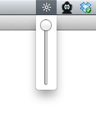

# DisplayBrightness

Control your Macbook display brightness from the Menubar.

## How to quite the app
Right click the menu bar app.

## Todo
* find better icon (free)
	* test application icon seems not look nice when selected.
	* test dark ui move
	* menubar icon size can be up to 18px
	* improve dark menubar support (low prio)
* code cleanup
* update loginitem to sierra

## Learned
* Menu bar images max height is 21px, retina 41px. 15px height looks best.
* I use 18px image with 15px content.
